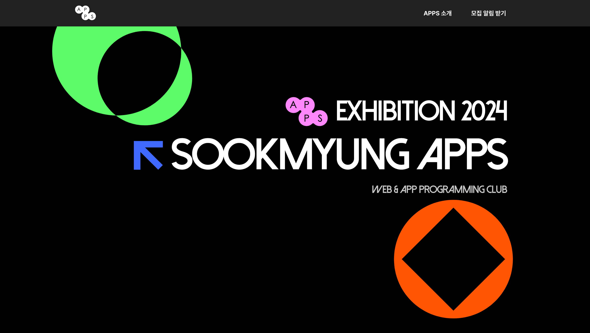

  
  <h1>Sookmyung APPS Exhibition 2024</h1>
  
<a href='https://github.com/APPS-sookmyung'>숙명여자대학교 소프트웨어학부 학회 APPS</a>   온라인 전시회

  <!--   -->

 

## 🗂️ 목차

1. [**웹 서비스 소개**](#1)
2. [**기술 스택**](#2)
3. [**데모 영상**](#3)
4. [**개발 팀 소개**](#4)
5. [**Git Convention**](#5)
6. [**개발 기간**](#6)

 

## 💡 웹 서비스 소개

숙명여자대학교 소프트웨어학부 학회 APPS의 <U>2024 온라인 전시회 사이트</U> 입니다. 
3월부터 열심히 노력하여 마침내 16개의 작품을 선보이게 되었습니다. 아래 사이트에서 그 힘찬 결실을 만나보실 수 있습니다.

> 새 창 열기 방법 : CTRL+click (on Windows and Linux) | CMD+click (on MacOS)

 

## 🛠 기술 스택

### **Front-end**

|  |  |  |  |
| :----------------------------------------------------------------------------------------------------------------------------: | :--------------------------------------------------------------------------------------------------------------------------: | :-----------------------------------------------------------------------------------------------------------------------------: | :-------------------------------------------------------------------------------------------------------------------------------: |
|                                                             HTML5                                                              |                                                             CSS3                                                             |                                                        JavaScript (ES6)                                                         |                                                             React.js                                                              |

### **Back-end**

|  |
| :--------------------------------------------------------------------------------------------------: |
|                                               Netlify                                                |

### **Version Control**

|  |  |
| :---------------------------------------------------------------------------------------------------------------: | :--------------------------------------------------------------------------------------------------------------------: |
|                                                        Git                                                        |                                                         GitHub                                                         |

 

## 🎥 데모 영상

- 업데이트 예정

 

## 🏄🏻‍♀️ 개발 팀 소개

 

|                                               이미지                                                |                                       이름 (세부 전공)                                       |   역할    |                                            개발 내용                                            |
| :-------------------------------------------------------------------------------------------------: | :------------------------------------------------------------------------------------------: | :-------: | :---------------------------------------------------------------------------------------------: |
|  | <a href="https://github.com/junheekim61" target="_blank">김준희 (소프트웨어학부 22)</a> | Front-end |                           프로젝트별 상세 페이지 구현 반응형 구현                            |
|  | <a href="https://github.com/misung-dev" target="_blank">류미성  (소프트웨어학부 21)</a> | Front-end |                               홈 화면 페이지 구현 반응형 구현                                |
|  | <a href="https://github.com/ninum12" target="_blank"> 이다빈  (소프트웨어학부 24) </a>  | Front-end |                           APPS 소개 및 활동 섹션 구현 반응형 구현                            |
|  | <a href="https://github.com/j1m1n-ha" target="_blank"> 하지민  (소프트웨어학부 22) </a> | Front-end | APPS 부원 소개 섹션 구현  부원별 상세 소개 모달 구현 Footer 컴포넌트 구현 반응형 구현 |

 

## 📌 Git Convention

### 🔵 Commit Convention

- `[FEAT]` : 새로운 기능 추가
- `[FIX]` : 버그, 오류 해결
- `[MODIFY]` : 코드 수정 (기능의 변화가 있을 때)
- `[DOCS]` : README나 WIKI 등의 문서 수정
- `[REMOVE]` : 폴더 또는 파일 삭제, 쓸모없는 코드 삭제
- `[RENAME]` : 파일 이름 변경 또는 파일 이동시
- `[REFACTOR]` : 기능 추가나 버그 수정이 없는 코드 변경 ( 코드 구조 변경 등의 리팩토링 )
- `[STYLE]` : 코드 formatting, 세미콜론 누락, 코드 자체의 변경이 없는 경우
- `[DESIGN]` : CSS 등 사용자 UI 디자인 변경
- `[CHORE]` : src 또는 test 파일을 수정하지 않는 기타 변경 사항 ( 빌드/패키지 매니저 설정 변경 등 )
- `[MERGE]` : merge 하는 경우
- `[!HOTFIX]` : 급하게 치명적인 버그를 고쳐야 하는 경우

### 커밋 예시

- git commit -m "#이슈번호 커밋 태그: 커밋 내용"
  - ex) `git commit -m "#198 [FEAT] Header 기능 구현"`

 

### 🔵 Branch Convention

- `main` : 최종 배포
- `dev` : 주요 개발, main merge 이전에 거치는 branch
- `feat` : 각자 개발, 기능 추가
- `fix` : 에러 수정, 버그 수정
- `docs` : README, 문서
- `refactor` : 코드 리펙토링 (기능 변경 없이 코드만 수정할 때)
- `modify` : 코드 수정 (기능의 변화가 있을 때)

### 브랜치 명 예시

- feat/#이슈번호-기능 이름
  - ex) `feat/#21-header`

 

### 🔵 Branch Strategy

- Git-flow 전략을 기반으로 `main`, `dev` 브랜치와 `feat` 보조 브랜치를 운용했습니다.
- `main`, `dev`, `feat` 브랜치로 나누어 개발을 하였습니다.
  - `main` 브랜치는 배포 단계에서만 사용하는 브랜치입니다.
  - `dev` 브랜치는 개발 단계에서 git-flow의 master 역할을 하는 브랜치입니다.
  - `feat` 브랜치는 기능 단위로 독립적인 개발 환경을 위하여 사용하고 merge 후 각 브랜치를 삭제해주었습니다.

 

### 🔵 Issue Convention

- [FEAT] : 기능 추가
- [FIX] : 에러 및 버그 수정
- [DOCS] : README 등 문서
- [REFACTOR] : 코드 리펙토링 (기능 변경 없이 코드만 수정할 때)
- [MODIFY] : 코드 수정 (기능의 변화가 있을 때)
- [CHORE] : 그 외 작업 내용

### 이슈 명 예시

- [이슈 항목] 개발 내용
  - `ex) [FEAT] Header 구현`

 

## 📅 개발 기간

2024년 11월 3일 ~ ing
